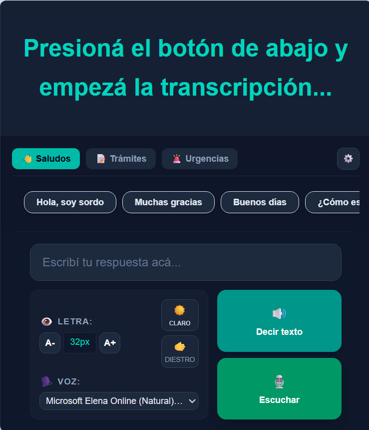
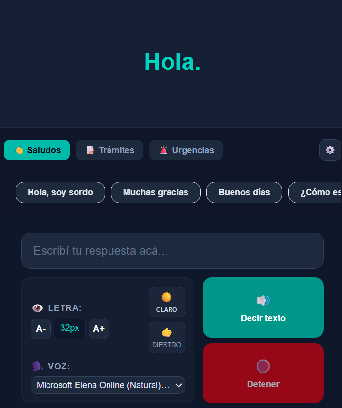
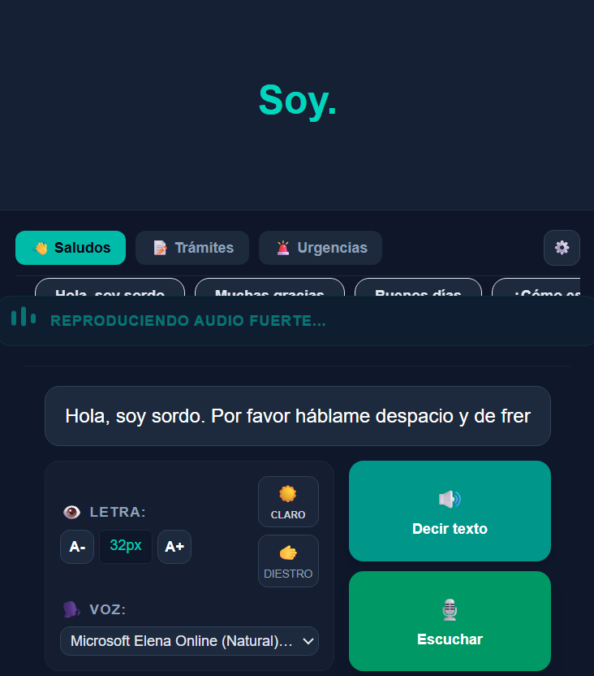
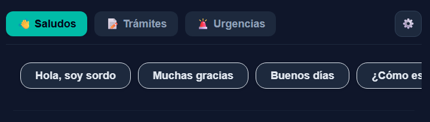
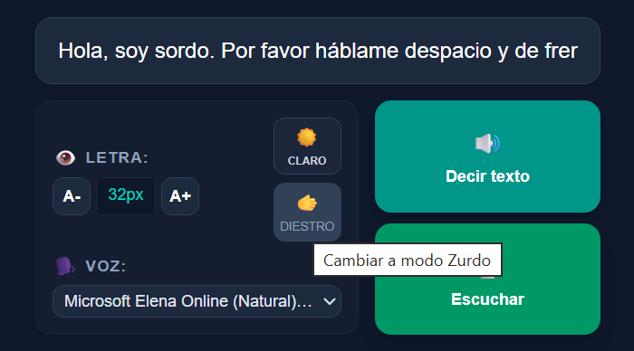
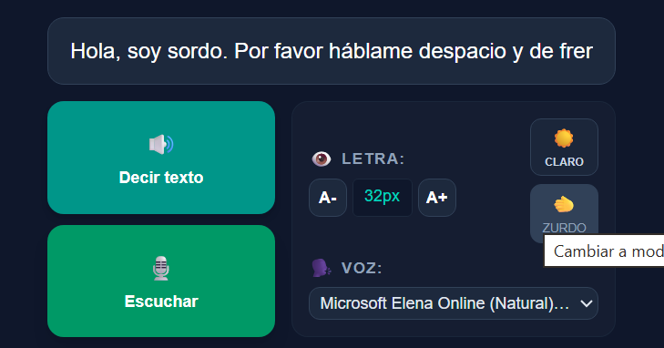

# ¿Qué Decís? — Asistente de Comunicación Inclusiva para Mostradores Públicos


¿Qué Decís? es un Producto Mínimo Viable (MVP) diseñado bajo los principios del **Diseño Universal** para eliminar las barreras de comunicación en entornos de atención al público (como efectores de salud, oficinas gubernamentales o comercios). La aplicación funciona como un canal accesible bidireccional que asiste a personas con discapacidad auditiva (hipoacusia o sordera) o dificultades del habla, permitiendo una interacción fluida, digna y autónoma con el personal de atención sin depender de intermediarios.

La solución está desarrollada como una **PWA (Progressive Web App)** con capacidades **100% offline para todas sus funciones** (tanto síntesis como transcripción de voz local vía WebAssembly), garantizando privacidad absoluta por diseño y total operatividad en zonas sin conectividad a internet.

---

## 🚀 Características Clave y UX Inclusiva

* **Doble Motor de Voz (Online / Offline Real):** Permite alternar dinámicamente entre la API nativa del navegador y un motor offline local (`Vosk WASM`) para transcribir la voz incluso sin conexión a internet.
* **Voz a Texto en Tiempo Real:** Captura el dictado del agente oyente a través del micrófono y lo traduce instantáneamente en subtítulos de alta visibilidad.
  
    
   
*   **Texto a Voz Instantáneo:** Permite al usuario tippear respuestas personalizadas que el motor de síntesis reproduce de forma audible con acentos locales.
   
   

*   **Catálogo de Frases Rápidas:** Selector horizontal (carrusel) optimizado para dispositivos móviles que agrupa expresiones de uso común organizadas por categorías (*Trámites, Saludos, Urgencias*).
  
*   **Ergonomía Adaptativa (Modo Zurdo):** Permite invertir la disposición de la botonera principal para facilitar la operación con un solo pulgar según la lateralidad del usuario.
    
*   **Control de Accesibilidad Visual:** Ajuste dinámico de tipografía (hasta 60px) en tiempo real y cuenta con modo claro/oscuro nativo con Tailwind v4 y variables CSS semánticas.
*   **Privacidad por Diseño (Privacy by Design):** El procesamiento de voz ocurre localmente en el silicio del dispositivo; ninguna conversación o dato sensible se almacena ni se transfiere a servidores externos.
*   **

---

## 🧠 Patrones de Diseño y Arquitectura Frontend

Para soportar múltiples motores de reconocimiento de voz de forma escalable sin acoplar la interfaz de usuario, se implementaron patrones de diseño de software avanzados:

* **Strategy Pattern (Patrón Estrategia):** Se definió un contrato base `SpeechEngine` que es implementado por dos motores independientes:
  * `WebSpeechEngine`: Estrategia online usando la API nativa `SpeechRecognition`.
  * `VoskEngine`: Estrategia offline utilizando WebAssembly (`vosk-browser`) y procesamiento en Web Workers.
* **Barrel Pattern (Archivos Barril):** Módulos encapsulados bajo `index.ts` para exponer únicamente las interfaces públicas (`SpeechEngine`, `SpeechEngineType`) e implementar ocultamiento de información.
* **Custom Hook Orquestador (`useSpeechRecognition`):** Actúa como middleware entre los componentes presentacionales de React y la estrategia activa, gestionando estados asíncronos como `isLoading` (carga del modelo WASM) y `engineError`.

---

## 🛠️ Stack Tecnológico

El núcleo de la aplicación fue construido utilizando herramientas modernas de desarrollo frontend para garantizar velocidad de renderizado, escalabilidad y compatibilidad:

*   **Framework:** [Next.js](https://nextjs.org/) 15+ (App Router) y React.
*   **Lenguaje:** TypeScript (Tipado estático para robustez del código y escalabilidad).
*   **Estilos y UI:** [Tailwind CSS](https://tailwindcss.com/) v4 para un diseño responsivo, utilitario y manejo de transiciones fluidas.
*   **Base de Datos / Persistencia:** Upstash Redis (Solución Serverless de baja latencia mediante REST API).
*   **Despliegue e Infraestructura:** Vercel (CI/CD automatizado y variables de entorno seguras).
*   **Íconos:** [Lucide React](https://lucide.dev/) para una iconografía limpia y de alta legibilidad.
*   **Motor PWA:** [@ducanh2912/next-pwa](https://github.com/ducanh2912/next-pwa) para la automatización de Service Workers y estrategias de almacenamiento en caché local.
*   **APIs Nativas del Navegador (Web APIs):**
    *   `Web Speech API (SpeechRecognition)` para la transcripción del habla a texto.
    *   `SpeechSynthesis` para la lectura artificial del texto a voz.
    *   `AudioContext` y `MediaDevices API` para la captura e inyección directa de ondas de audio hacia WebAssembly.
*   **Formspree API:** Servicio integrado asíncronamente para la recolección centralizada de feedback cualitativo.

---

## 📂 Estructura del Código

El proyecto sigue la convención limpia de carpetas de Next.js (App Router), aislando responsabilidades y encapsulando componentes reutilizables:

```text
├── app/
│   ├── api/
│   │   └── downloads/
│   │       └── route.ts         # Endpoint de API atómico para el contador global con Upstash
│   ├── app-core/
│   │   └── page.tsx             # Panel principal de la aplicación (Dictado de voz y Texto a voz)
│   ├── layout.tsx               # Envoltura global de estilos y metadatos del sistema
│   └── page.tsx                 # Landing Page principal optimizada para conversión y feedback
├── components/
│   ├── FeedbackForm.tsx         # Componente modularizado e inclusivo de recolección de feedback
│   ├── Features.tsx             # Bloque estático de características del sistema
│   ├── Manual.tsx               # Guía rápida e instructivo visual de uso
│   ├── PWARegistrationCounter.tsx # Contador visual conectado al endpoint de descargas
│   └── logo.tsx                 # Identidad visual vectorizada del proyecto
├── public/
│   ├── icons/                   # Manifiesto de iconos requeridos para cumplimiento PWA
│   ├── image/                   # Assets visuales y fondos optimizados
│   ├── manifest.json            # Configuración de instalación PWA para Android/iOS/Desktop
│   ├── sw.js                    # Service Worker autogenerado en producción
│   └── workbox-*.js             # Scripts de soporte de Workbox para estrategias de caché
├── next.config.mjs              # Configuración del compilador y plugins de Next.js
└── .env.local                   # Variables de entorno locales (Excluido de Git)
```


## 🔍 Notas de Compatibilidad y Limitaciones Técnicas (MVP)

Durante la fase actual del Producto Mínimo Viable (MVP), la aplicación implementa una estrategia híbrida de conectividad:

* **Soporte PWA Offline:** La interfaz gráfica, la arquitectura de componentes, las frases rápidas y el manual de asistencia técnica están completamente guardados de forma local en la memoria caché del celular gracias al Service Worker y funcionan **100% sin conexión a internet**.
* **Dependencia de Red para Dictado (Voz a Texto):** Debido a que la API nativa `SpeechRecognition` de Google Chrome delega el procesamiento del audio en los servidores de reconocimiento de voz de Google, **la funcionalidad de transcripción requiere conectividad a internet activa**. La síntesis de voz (Texto a Voz), por el contrario, utiliza los paquetes de voz locales del sistema operativo y mantiene soporte offline en la mayoría de los dispositivos.
* **Escalabilidad Futura:** Para lograr un entorno 100% offline en el dictado, se contempla en futuras versiones la integración de modelos de lenguaje locales optimizados para dispositivos móviles (como *Whisper TFLite* o librerías WebAssembly corriendo en el cliente).
---

## Soporte Offline y Capacidades PWA
¿Qué Decís? no requiere conexión a internet continua para transcribir voz:


* **Soporte PWA Completo:** La interfaz gráfica, la arquitectura de componentes, el Service Worker y el motor de síntesis de voz quedan guardados de forma local en el almacenamiento del dispositivo.

* **Modelo Local de Lenguaje (Vosk WASM):** Al seleccionar el modo Offline (Vosk WASM) en la barra de controles, la PWA inicializa un Web Worker que descarga en memoria el modelo liviano en español (```vosk-model-small-es-0.42```). Toda la conversión de señal de audio a texto se realiza dentro del navegador del usuario sin enviar un solo paquete de datos a la red.

* **Modo Híbrido Recomendado:** Permite al usuario usar el modo Online para transcripciones ultra rápidas cuando hay red, y conmutar en un toque al modo Offline cuando viaja o se encuentra en zonas de atención con mala cobertura.


## 🛠️ Bitácora de Troubleshooting (Resolución de Problemas en Producción)

Durante el ciclo de desarrollo y despliegue del MVP, se identificaron y solucionaron tres desafíos técnicos de nivel arquitectónico en el entorno productivo:
### **Desafío A:** Error de Inyección Asíncrona en el Service Worker (```_async_to_generator```) en Entornos Windows

* **Síntoma:** La consola del inspector arrojaba un error crítico: ```Uncaught (in promise) ReferenceError: _async_to_generator is not defined``` en el archivo ```sw.js```, congelando la actualización de la PWA.

* **Causa:** El plugin de PWA inyectaba funciones asíncronas modernas en el entorno de desarrollo bajo Windows que, al no ser correctamente procesadas por los polyfills de Workbox, rompían la compatibilidad con el navegador.

* **Solución:** Se limpiaron manualmente los archivos obsoletos de la carpeta ,```public/``` y se inyectó una configuración de Workbox blindada en el archivo ```next.config.mjs``` para forzar la correcta compilación y control del Service Worker en el cliente:
  
```Javascript

workboxOptions: {
  skipWaiting: true,
  clientsClaim: true,
}  

```

### **Desafío B:** Error de Desconexión de Red en Computadoras de Escritorio (```Error de transcripción: network```)

* **Síntoma:** Al utilizar el dictado por voz desde una computadora de escritorio, la ```Web Speech API``` se interrumpía abruptamente arrojando un error de tipo ```network```.

* **Causa:** Los navegadores de escritorio envían de forma nativa los paquetes de audio del micrófono a servidores remotos para procesar el dictado. Ante micro-cortes de red o latencias en el servidor, la API se desconecta automáticamente. Los celulares procesan esto de forma híbrida/local, por lo que no sufrían el bug de manera constante.

* **Solución:** Se implementó una lógica de resiliencia activa en el evento ```recognition.onerror```. Si el error es de tipo network y la interfaz de usuario indica que el administrativo aún desea dictar (```isListening === true```), el sistema captura el error de forma silenciosa e intenta una reconexión automática del micrófono tras un retraso controlado de 1 segundo:
  
```TypeScript

if (event.error === 'network' && isListening) {
  setTimeout(() => {
    try { recognition.start(); } catch (e) { /* Ya activo */ }
  }, 1000);
}
```

### **Desafío C:**Fallo en el Consumo del Contador Global (Error de parseo JSON ```Unexpected token '<'```)

* **Síntoma:** El componente del contador arrojaba un error al intentar deserializar la respuesta del servidor: ```SyntaxError: Unexpected token '<', "<!DOCTYPE "... is not valid JSON```.

* **Causa:** La ruta de la API en Next.js estaba mal indexada debido a un plural incorrecto o archivos cacheados obsoletos en la carpeta ```.next```. Al fallar la ruta, Vercel devolvía una página de error 404 en HTML nativo (```<!DOCTYPE html>```), el cual fallaba al ser leído por el método ,```.json()```.

* **Solución:** Se renombró estrictamente el archivo de la API a la convención singular obligatoria (``` app/api/downloads/route.ts```), se eliminó manualmente la caché local y se desplegó una respuesta atómica conectada directamente al SDK Serverless de Upstash Redis.

### **Desafío D: Prop Drilling Redundante y Parpadeo Visual (FOUC) en el Cambio de Tema Claro/Oscuro

* **Síntoma:** El cambio de tema provocaba un parpadeo de color molesto al renderizar la app por primera vez y la consola reflejaba una sobrecarga de datos debido al paso innecesario de la propiedad isLightMode (prop drilling) a través de múltiples componentes que no la utilizaban directamente.
* **Causa:** Los componentes dependían de condicionales de JavaScript para alternar sus clases CSS. Al no estar sincronizado el estado de manera nativa con el árbol de renderizado del documento, el navegador no podía determinar los colores correctos de inmediato, rompiendo además el contraste de componentes críticos como el Header y la sección del Manual.
*  **Solución:** Se migró la arquitectura de estilos a variables semánticas de Tailwind v4 (como bg-bg-main y text-text-main), eliminando el paso de propiedades redundantes en las interfaces de React. Asimismo, se programó un useEffect en el hook useAppSettings para inyectar o remover directamente la clase .light en la etiqueta raíz <html> del documento:
  
```TypeScript

// Sincronizador de Tema Global en hooks/useAppSettings.ts
useEffect(() => {
  if (typeof window !== 'undefined') {
    const root = window.document.documentElement;
    if (isLightMode) {
      root.classList.add('light');
      root.classList.remove('dark');
    } else {
      root.classList.add('dark');
      root.classList.remove('light');
    }
  }
}, [isLightMode]);
```


### **Desafío E: Incompatibilidad de Tipos de Mensajes en Vosk y Error 404 al Cargar el Modelo WASM

* **Síntoma:** Error de TypeScript ```ts(2345)``` en los eventos .on('result') y congelamiento de la UI en estado "Cargando..." con error ```HTTP 404```.
* **Causa:** La interfaz nativa de ```vosk-browser``` utiliza firmas internas no exportadas en el nivel superior y la URL del modelo no estaba sirviéndose en el path relativo correcto de Next.js.
*  **Solución:** Se resolvió el tipado de TypeScript usando la aserción segura (```message: unknown```) con validación opcional (```msg?.result?.text```) evitando el uso de any. Asimismo, se corrigió el path hacia ```/models/vosk-model-small-es-0.42.zip``` alojado dentro del directorio ```/public``` de Next.js.


---

## 🤖 Desarrollo Asistido por Inteligencia Artificial (AI-Driven Development)

Este proyecto adoptó un enfoque moderno de desarrollo integrando Inteligencia Artificial (Modelos Fundacionales Avanzados como Gemini) de manera iterativa como soporte al flujo de trabajo del desarrollador. El objetivo de la integración de la IA no fue delegar la arquitectura, sino actuar como un acelerador de productividad y un copiloto estratégico en las siguientes áreas:

* **Optimización de Arquitectura y Componentes:**  Se utilizó el análisis de la IA para refactorizar bloques de código monolítico en componentes modulares limpios (como el caso de ```FeedbackForm.tsx```), asegurando el cumplimiento de los patrones de diseño de React y la separación de responsabilidades (Separation of Concerns).

* **Pair Programming para Troubleshooting:**  Frente a errores complejos de compilación asíncrona en entornos cruzados (como el bug del Service Worker en Windows) o interrupciones de Web APIs nativas, la IA actuó como pair programmer para acelerar la detección de la causa raíz (Root Cause Analysis) y formular soluciones blindadas.

* **Mejoras de Accesibilidad y UX:** Consultas puntuales sobre las mejores prácticas en el diseño centrado en el usuario para adaptar lógicas de interfaz que abrazaran genuinamente los conceptos de Diseño Universal.
  
* **Diseño de Arquitectura y Patrones:** Asistencia en la implementación del Strategy Pattern para desacoplar el reconocimiento nativo del motor de WebAssembly (Vosk), abstrayendo la lógica en Hooks customizados de React.

---

## 🔒 Gestión de Variables de Entorno y Seguridad
El proyecto implementa la separación estricta de credenciales utilizando el prefijo ```NEXT_PUBLIC_``` únicamente para aquellas variables que requieren accesibilidad desde el contexto del cliente (Client Components), garantizando portabilidad absoluta entre entornos.

Variables requeridas en el archivo ```.env.local``` y en los secretos de Vercel:

* ```NEXT_PUBLIC_FORMSPREE_URL```: Endpoint de destino asíncrono para el formulario de feedback de usuarios y profesionales.

* ```UPSTASH_REDIS_REST_URL```: URL del cluster serverless de Redis para el contador de instalaciones (Manejado de forma segura del lado del servidor).

* ```UPSTASH_REDIS_REST_TOKEN```: Token de autenticación portador para operaciones de incremento atómico (Manejado en el servidor).
___

## 🔒 Política de Privacidad y Términos de Uso (MVP)

Al ser una solución diseñada bajo principios de **Privacidad por Diseño**, la aplicación establece los siguientes compromisos de transparencia:

*   **Procesamiento de Voz:** El flujo de audio capturado por el micrófono se procesa exclusivamente en el dispositivo del usuario final mediante la Web Speech API nativa. Ninguna conversación es grabada, almacenada, ni transmitida a servidores propios de la aplicación.
*   **Formularios y Feedback:** Los datos de contacto o comentarios enviados a través del formulario de retroalimentación son procesados de forma voluntaria por el usuario y gestionados de manera segura mediante la API asíncrona de Formspree con el único fin de implementar mejoras de usabilidad.
*   **Uso del Sistema:** Esta aplicación se distribuye de forma gratuita y con fines sociales como un canal de asistencia a la accesibilidad. El usuario es responsable de otorgar los permisos de micrófono necesarios en su navegador para el correcto funcionamiento de las Web APIs.

___

<div align="center">

|  Desarrolladora   |                      |
| :------------------- | :----------------------------------------------- |
| **Luciana Quilcate (Luma)** | **[github](https://github.com/Luma2001)**        |

</div>